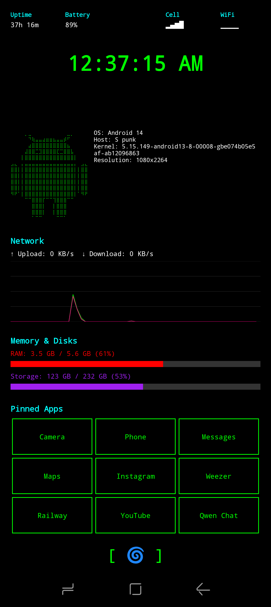

# Init Launcher

A minimal, stripped-metal style Android launcher with system monitoring capabilities inspired by terminal aesthetics and neofetch.

## Features

- **System Monitor**: Real-time display of RAM, storage, and network stats with live graphs
- **Neofetch-style Header**: ASCII art Android logo with device info
- **Pinned Apps Grid**: Quick access to 9 favorite apps (3x3 grid)
- **App Drawer**: Full list of installed applications with search and sorting (Recent/A-Z)
- **Bare Metal Aesthetic**: Black background, neon green monospace text, 1dp borders
- **Network Graph**: Real-time network speed visualization
- **Lightweight**: Minimal resource footprint, perfect for older devices

## Screenshots



## Installation

### From Source

1. Clone this repository:
   ```bash
   git clone https://github.com/usr-wwelsh/init-launcher.git
   cd init-launcher
   ```

2. Open the project in Android Studio

3. Sync Gradle files

4. Build and run on a device or emulator (Android 5.0+)

### APK Release

Check the [Releases](https://github.com/usr-wwelsh/init-launcher/releases) page for pre-built APK files.

## Usage

- **Launch Apps**: Tap on any pinned app name
- **Reorder Pinned Apps**: Long-press and drag a pinned app to reorder
- **Replace Pinned App**: Double-tap on a pinned app slot to select a new app
- **View All Apps**: Tap the cyclone emoji button `[ 🌀 ]` to open the app drawer
- **Search Apps**: Use the search bar in the app drawer to filter applications
- **Sort Apps**: Tap "Recent" or "A-Z" in the top-right of the app drawer to toggle between recently used and alphabetical sorting
- **Set as Default Launcher**: Long-press the cyclone emoji button to access launcher settings, or Android will prompt you on first home button press

## Permissions

- `QUERY_ALL_PACKAGES`: Required to list all installed apps (Android 11+)
- `INTERNET` / `ACCESS_NETWORK_STATE`: Required for network speed monitoring
- `PACKAGE_USAGE_STATS`: Optional, for better app management

## Technical Details

- **Language**: Kotlin
- **UI Framework**: XML (View-based)
- **Min SDK**: 21 (Android 5.0 Lollipop)
- **Target SDK**: 34 (Android 14)
- **Architecture**: MVVM-lite with Android lifecycle components

## Project Structure

```
app/src/main/
├── java/com/initlauncher/
│   ├── MainActivity.kt          # Main launcher screen with monitoring
│   ├── AppGridAdapter.kt        # RecyclerView adapter for pinned apps
│   ├── AppDrawerActivity.kt     # Full app list screen
│   ├── AppDrawerAdapter.kt      # Adapter for app drawer list
│   └── NetworkGraphView.kt      # Custom view for network graph
├── res/
│   ├── layout/
│   │   ├── activity_main.xml    # Main launcher layout
│   │   ├── activity_app_drawer.xml
│   │   └── item_app.xml         # App item layout
│   ├── values/
│   │   ├── colors.xml           # Theme colors
│   │   └── strings.xml
│   └── drawable/
│       ├── ic_launcher.xml      # App icon
│       └── app_item_background.xml
└── AndroidManifest.xml
```

## Customization

### Color Scheme

Edit `app/src/main/res/values/colors.xml` to change the color scheme:
```xml
<color name="neon_green">#00FF00</color>   <!-- Primary text -->
<color name="neon_cyan">#00FFFF</color>    <!-- Headers -->
<color name="black">#000000</color>        <!-- Background -->
```

### Pinned App Count

Modify the grid size in `activity_main.xml` to change the number of pinned apps (default: 9 in a 3x3 grid).

## Roadmap

- [ ] Custom icon packs support
- [ ] Widget support
- [ ] Theme presets (amber, blue, red terminals)

## Contributing

Contributions are welcome! Please feel free to submit a Pull Request.

1. Fork the repository
2. Create your feature branch (`git checkout -b feature/AmazingFeature`)
3. Commit your changes (`git commit -m 'Add some AmazingFeature'`)
4. Push to the branch (`git push origin feature/AmazingFeature`)
5. Open a Pull Request

## License

This project is licensed under the MIT License - see the [LICENSE](LICENSE) file for details.

## Author

**usr-wwelsh**

- GitHub: [@usr-wwelsh](https://github.com/usr-wwelsh)

## Acknowledgments

- Inspired by Unix/Linux terminal aesthetics
- Neofetch for the ASCII art concept
- The Android developer community
